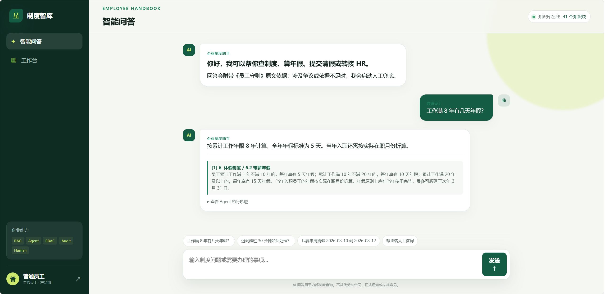
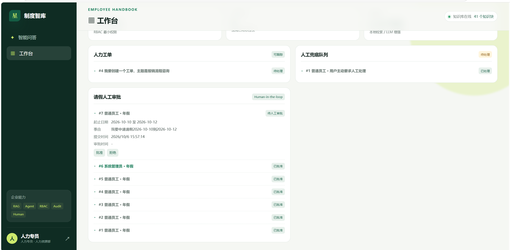
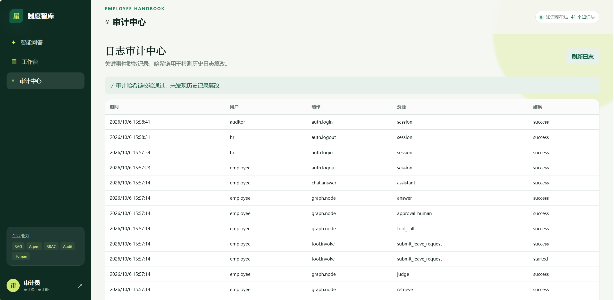
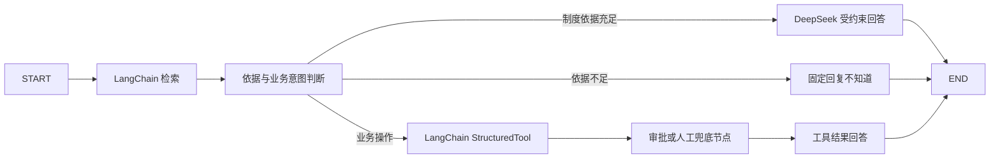

# 企业制度问答与人事流程助手

一个可运行的企业内部 AI 助手示例：用自然语言查制度、算年假、提交请假并走人工审批——**AI 只做它能负责的部分，最终决定权留给人**。

项目适配 Python 3.12，可直接用 PyCharm 打开根目录并运行 `main.py`。使用 LangChain 构建 DOCX RAG，使用 LangGraph 编排企业 Agent，通过 `DEEPSEEK_API_KEY` 调用 `deepseek-chat`——DeepSeek 只负责依据已命中的制度片段生成答案，不直接执行任何业务操作。

> 项目自带一份**自编的示例员工守则**（约 4400 字 / 14 章）用于演示检索与问答；替换成你自己的制度文档即可。

<!--
截图占位：跑起来后截 3 张图放进 docs/images/，然后把下面三行的注释去掉



-->

## 已实现的企业级能力

| 能力 | 项目实现 |
|---|---|
| RAG | LangChain `Docx2txtLoader` 加载 DOCX，`RecursiveCharacterTextSplitter` 分块，BM25 Retriever + LCEL 检索链返回引用 |
| Agent | LangGraph 显式建模“检索 → 判断 → 工具调用 → 审批/人工兜底 → 回答”状态图 |
| **意图路由** | **确定性规则优先**：疑问句且无明确动作词 → 走知识检索；只有“我要申请 / 帮我提交”这类动作句才触发写工具，避免“问流程”被当成“办业务” |
| DeepSeek | `ChatOpenAI` 通过 DeepSeek 兼容接口调用 `deepseek-chat`，Prompt 严格限制只能依据知识库回答 |
| 工具调用 | 业务工具包装为 LangChain `StructuredTool`，并继续经过原有 ToolRegistry、RBAC 和审计入口 |
| 权限控制 | employee / hr / auditor / admin 四种角色；API 和工具层双重 RBAC 最小权限校验 |
| 日志审计 | 登录、对话、工具调用、审批、重建索引均记录；敏感字段脱敏；SHA-256 串联哈希检测篡改 |
| 无答案处理 | 知识库依据不足时固定回复“我不知道，知识库中没有相关内容”，不调用 DeepSeek、不自动创建人工单 |
| 人工兜底 | 只有用户明确要求转人工时创建人工处理单 |
| 人在回路 | AI 只能提交请假申请，最终批准或拒绝必须由 HR 人工完成 |

## 设计要点：区分「咨询 / 申请 / 审批」

这是本项目最核心的一条设计线。同样的字眼，在不同句式里含义完全不同：

| 用户说的是 | 系统应判为 | 行为 |
|---|---|---|
| “请假申请**流程**是什么？” | **咨询** | 走知识检索，回答制度原文，**不落库** |
| “我要申请请假 2026-08-10 到 08-12” | **申请** | 创建申请单，状态为**待审批** |
| HR 在工作台点批准 / 拒绝 | **审批** | 由人做出最终决定 |

判错的代价是不对等的：**误答只是不精确，误操作会产生副作用**——所以疑问句一律优先按咨询处理。检索层也做了配套保护：覆盖率只统计“能在语料里定位到的实质词”，并要求**至少两个主题词**才算有依据，避免仅凭通用词（如“公司”）或跨词碎片作答。

## LangGraph 执行流程


```mermaid
flowchart LR
    A[START] --> B[LangChain 检索]
    B --> C[依据与业务意图判断]
    C -->|制度依据充足| G[DeepSeek 受约束回答]
    C -->|依据不足| U[固定回复不知道]
    C -->|业务操作| D[LangChain StructuredTool]
    D --> E[审批或人工兜底节点]
    E --> F[工具结果回答]
    G --> H[END]
    U --> H
    F --> H
```

## 项目结构

```text
projectqiyeAI/
├─ app/
│  ├─ agent.py          # LangGraph 五节点状态图 + 意图路由
│  ├─ rag.py            # LangChain DOCX、分块、BM25、LCEL 检索链
│  ├─ tools.py          # StructuredTool、权限门、业务工具
│  ├─ security.py       # 密码、会话令牌、RBAC
│  ├─ audit.py          # 日志脱敏与防篡改哈希链
│  ├─ database.py       # SQLite 表与演示数据
│  ├─ llm.py            # LangChain Prompt 与 DeepSeek 回答链
│  ├─ api.py            # FastAPI 接口
│  └─ static/           # 企业内部助手网页
├─ tests/               # 自动化测试（63 项）
├─ eval/                # 知识库质量评测（题库 + 指标 + 报告）
├─ 员工守则_美化版.docx # 自编示例知识库源文件
├─ main.py              # PyCharm 直接运行入口
├─ setup.ps1            # Python 3.12 环境初始化脚本
└─ requirements.txt
```

## 在 PyCharm 中运行

### 方法一：使用 PyCharm 创建虚拟环境

1. 用 PyCharm 打开整个 `projectqiyeAI` 目录。
2. 打开 `File → Settings → Project → Python Interpreter`。
3. 选择 `Add Interpreter → Add Local Interpreter → Virtualenv`。
4. Base interpreter 选择本机 Python 3.12，Location 使用项目下的 `.venv`。
5. 打开 PyCharm Terminal，运行：

```powershell
python -m pip install -r requirements.txt
```

6. 打开 `main.py`，右键选择 `Run 'main'`。
7. 浏览器访问 <http://127.0.0.1:8000>。

### 方法二：PowerShell 一键初始化

在项目根目录运行：

```powershell
powershell -ExecutionPolicy Bypass -File .\setup.ps1
```

随后在 PyCharm 中选择 `.venv\Scripts\python.exe`，运行 `main.py`。

## 演示账号

| 角色 | 账号 | 密码 | 重点演示 |
|---|---|---|---|
| 普通员工 | `employee` | `Employee@123` | 制度问答、年假计算、工单、请假、转人工 |
| HR | `hr` | `Hr@123456` | 人工兜底队列、请假审批、全量工单 |
| 审计员 | `auditor` | `Audit@123` | 审计日志与哈希链校验 |
| 管理员 | `admin` | `Admin@123` | 全部管理能力、知识库重建 |

这些账号仅用于本地演示。生产环境必须接入 SSO/LDAP，并删除演示账号。

## 推荐演示流程

1. 员工登录后提问：`工作满 8 年有几天年假？`
   - Agent 调用年假计算工具，并引用“6.2 带薪年假”。
2. 提问：`迟到超过 30 分钟如何处理？`
   - RAG 返回考勤条款和原文依据。
3. 输入：`请假申请流程是什么`
   - 判为**咨询**，返回制度原文，**不创建任何单据**。
4. 输入：`我要申请请假 2026-08-10 到 2026-08-12`
   - AI 只创建申请，状态为**等待人工审批**。
5. 使用 HR 登录，在“工作台”批准或拒绝申请。
6. 员工提问：`公司食堂今天的菜单是什么？`
   - 知识库无可靠依据，固定回复“我不知道，知识库中没有相关内容”。
7. 使用审计员登录，检查各步骤日志以及审计链状态。
8. 尝试用普通员工访问 `/api/audit-logs`，会收到 HTTP 403，体现权限隔离。

## 知识库质量评测

`eval/` 下有一套可复跑的评测，用标注题库量化检索质量，而不是只看“能不能答上来”：

- **域内题库 26 题**，分三档难度：L1 原词直问 8 / L2 同义改写 8 / L3 口语化 10
- **域外题库 8 题**，用于检验“不该答的时候能不能拒答”

当前结果（详见 `eval/last_report.md`）：

| 指标 | 结果 |
|---|---|
| Recall@1 | **54%**（14/26） |
| Recall@4 | **65%**（17/26） |
| 域外拒答准确率 | **100%**（8/8，误召回 0） |
| 违反「疑问句只读」 | **0/6** |
| L1 原词直问 | 8/8 命中 |
| L3 口语化 | 3/10 命中（**当前短板，见下**） |

跑法：

```powershell
.venv\Scripts\python.exe -m eval.rag_eval
```

## DeepSeek 配置

项目会自动读取 Windows 系统环境变量 `DEEPSEEK_API_KEY`。也可以复制 `.env.example` 为 `.env`：

```env
DEEPSEEK_ENABLED=true
DEEPSEEK_API_KEY=你的密钥
DEEPSEEK_BASE_URL=https://api.deepseek.com
DEEPSEEK_MODEL=deepseek-chat
```

如果 DeepSeek 超时或不可用，知识库命中的问题会降级返回制度原文及引用；知识库未命中的问题仍然只回复不知道。修改系统环境变量后需要重启 PyCharm，才能让运行进程继承新的 Key。

## 会话密钥（启动前必填）

会话令牌使用 `APP_SECRET_KEY` 做 HMAC 签名，该密钥泄露或保持默认值即可伪造任意角色身份，因此**启动阶段会强制校验**：

- 密钥少于 32 位，或等于代码中的出厂默认值 → 直接拒绝启动并给出修复指引。
- 生成方式：`python -c "import secrets; print(secrets.token_urlsafe(32))"`，将结果写入 `.env` 的 `APP_SECRET_KEY`。

`.env` 已被 `.gitignore` 排除，切勿提交。

## 运行测试

```powershell
.venv\Scripts\python.exe -m pytest -p no:cacheprovider
```

当前结果：**63 项通过 / 1 项跳过**（跳过的是需要真实 DeepSeek Key 的联网用例）。

覆盖范围：

- **检索**：DOCX 加载与章节识别、分块元数据、双阈值命中与拒答、索引缓存与按文档哈希重建
- **路由与拒答**：三类路由、“咨询 vs 申请”区分、依据不足时不调用 LLM
- **降级**：生成器异常 / 未启用 / 返回空 三种情形均回退命中的原文
- **权限**：权限矩阵、工具目录按角色裁剪、工具层 403、越权不中断对话、`tool.denied` 审计
- **审批**：仅提交待批、HR 批准 / 拒绝、重复审批 409、非 HR 403
- **审计**：脱敏三类模式、落盘前脱敏、哈希链校验、4 个字段各自篡改后断链

> 需要真实 DeepSeek 的联网测试默认跳过，显式运行：
> ```powershell
> $env:RUN_DEEPSEEK_LIVE_TEST="1"
> python -m pytest -k deepseek_live
> ```

## 已知局限与后续计划

以下均为当前实现的**已知取舍**，不是缺陷清单遗漏：

| 局限 | 现状 | 后续方向 |
|---|---|---|
| 检索语义 | 仅 BM25 关键词匹配；L3 口语化提问召回仅 3/10，同义表述容易漏召回 | 关键词 + 向量混合检索 + 重排模型 |
| 意图路由 | 已加“咨询优先”判别（疑问句不触发写操作）；但仍是规则匹配，覆盖率依赖关键词表 | 规则优先 + 大模型 function-calling 兜底 |
| 对话记忆 | 每次提问独立处理，无多轮上下文 | 引入会话状态与 checkpointer |
| 存储 | SQLite 单机 + 本地 JSON 索引 | PostgreSQL + 独立索引服务 |
| 会话吊销 | 自实现 HMAC 令牌，登出仅删除客户端 Cookie | 接入企业 SSO/OIDC |
| 效果度量 | 已有标注题库（域内 26 / 域外 8）与 Recall@K、拒答准确率 | 扩充题库；补充人工评估维度 |
| 依赖 | `langchain-community` 已进入官方 sunset 流程（`Docx2txtLoader` 会报 DeprecationWarning） | 迁移到独立集成包 |
| 并发 | 每次请求新建连接，审计逐条写入事务 | 连接池 + 审计批量异步写入 |

## 更新员工守则

1. 保持文件名为 `员工守则_美化版.docx`，替换项目根目录文件；或在 `.env` 修改 `HANDBOOK_PATH`。
2. 重启服务会自动比较文件哈希并更新索引。
3. 管理员也可在网页“工作台”点击“重建知识库索引”。

索引生成在 `data/index.json`，业务与审计数据存放在 `data/enterprise_ai.db`。

## 生产化建议

- 用企业 SSO/OIDC 替换演示账号和本地签名会话。
- 将 SQLite 替换为 PostgreSQL，并对审计日志设置只追加存储和独立归档。
- 将本地 BM25 扩展为“关键词 + 向量”的混合检索，并增加重排模型。
- 为工具参数增加业务系统侧二次校验、幂等键和审批流回调。
- 将敏感信息分类、数据保留期、日志告警接入企业安全规范。
- 在生产反向代理启用 HTTPS、CSRF 防护、限流和安全响应头。
